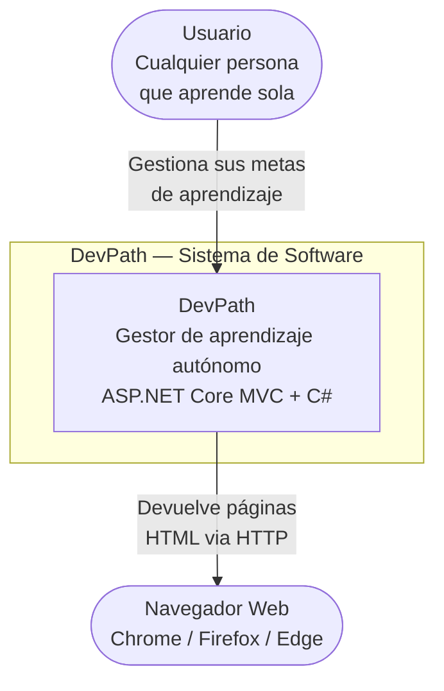

# Diagramas C4 — DevPath

## C4 Nivel 1 — Contexto del Sistema

**Para quién es:** cualquier persona, sin conocimientos técnicos.  
**Qué responde:** ¿Qué hace el sistema y quién lo usa?



> El sistema no tiene integraciones con sistemas externos en esta versión.
> Es autocontenido — todo corre dentro de un solo proyecto ASP.NET Core MVC.

---

## C4 Nivel 2 — Contenedores

**Para quién es:** equipo técnico.  
**Qué responde:** ¿En qué piezas técnicas está dividido el sistema y cómo se comunican?

```mermaid
graph TD
    Usuario([ Usuario\nNavegador Web])

    subgraph DevPath [DevPath — Sistema]
        WebApp[" Web App\nASP.NET Core MVC + C#\nControllers + Views + Razor"]
        API[" API REST\nASP.NET Core Web API\nEndpoints JSON + Swagger"]
        DB[(" SQL Server\nLocalDB\nDevPathDB")]
        EF[" Entity Framework Core\nORM Code First\nMigraciones")]
    end

    Usuario -->|HTTP/HTTPS\npeticiones web| WebApp
    Usuario -->|HTTP/HTTPS\nconsumo API| API
    WebApp -->|consulta y guarda\ndatos| EF
    API -->|consulta y guarda\ndatos| EF
    EF -->|SQL queries| DB
```

> La Web App y la API REST comparten el mismo DevPathContext y los mismos modelos.
> Entity Framework actúa como puente entre ambas y SQL Server.
> En desarrollo corre con IIS Express + LocalDB. Despliegue planeado: Azure App Service + Azure SQL.