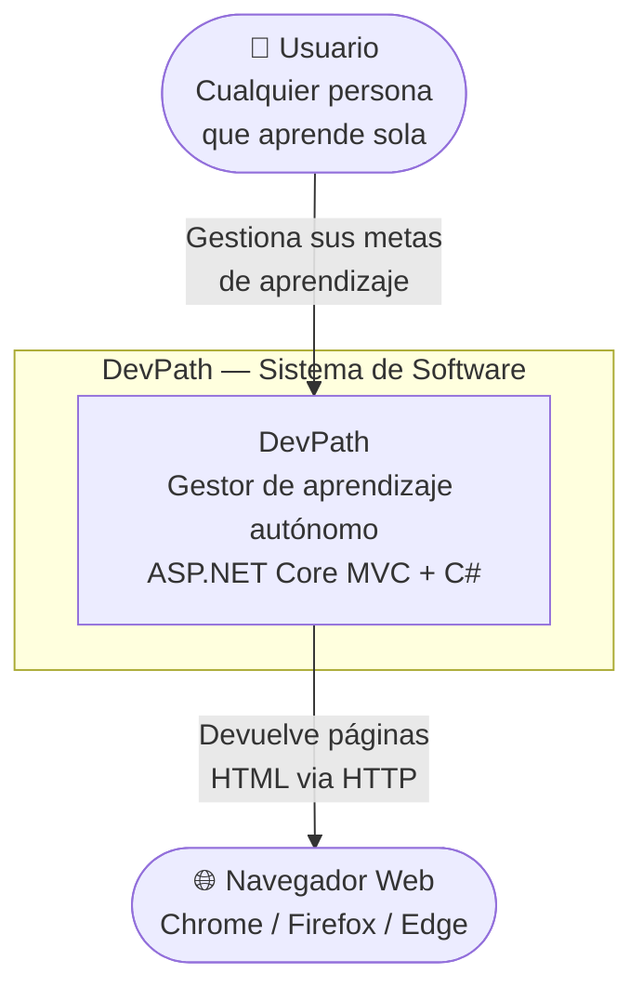

# Diagramas C4 — DevPath

## C4 Nivel 1 — Contexto del Sistema

**Para quién es:** cualquier persona, sin conocimientos técnicos.  
**Qué responde:** ¿Qué hace el sistema y quién lo usa?

> El sistema no tiene integraciones con sistemas externos en esta versión.
> Es autocontenido — todo corre dentro de un solo proyecto ASP.NET Core MVC.