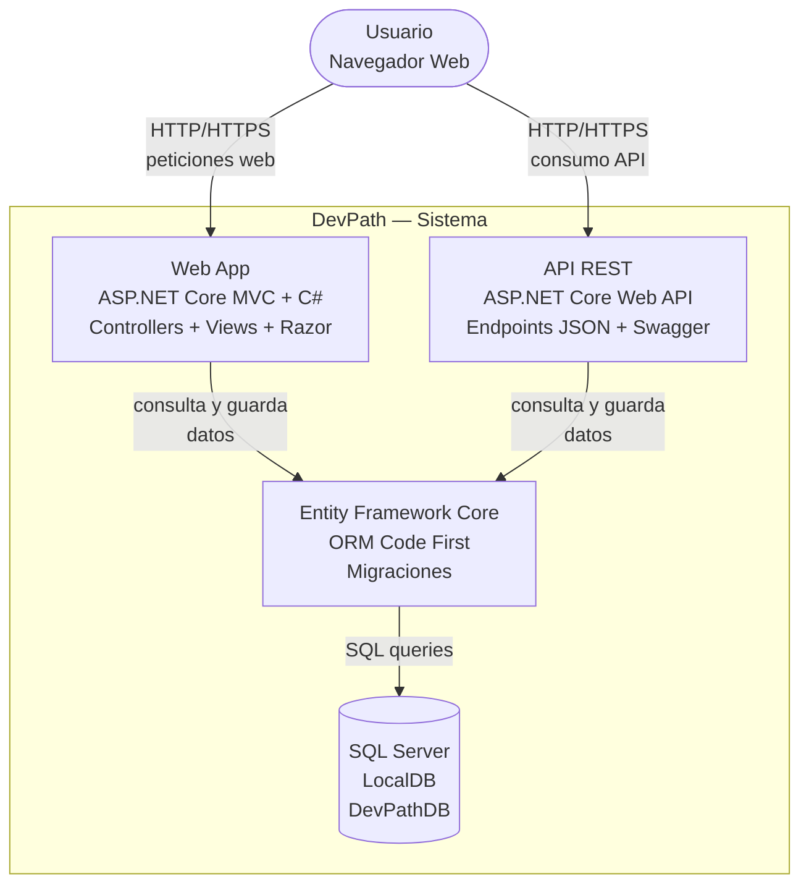
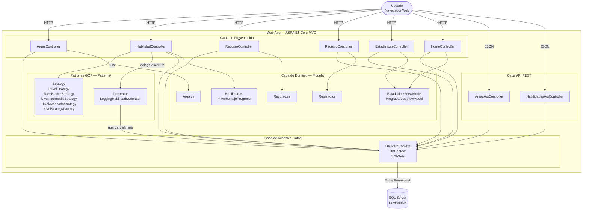

# Diagramas C4 — DevPath

## C4 Nivel 1 — Contexto del Sistema

**Para quién es:** cualquier persona, sin conocimientos técnicos.  
**Qué responde:** ¿Qué hace el sistema y quién lo usa?

> El sistema no tiene integraciones con sistemas externos en esta versión.
> Es autocontenido — todo corre dentro de un solo proyecto ASP.NET Core MVC.

---

## C4 Nivel 2 — Contenedores

**Para quién es:** equipo técnico.  
**Qué responde:** ¿En qué piezas técnicas está dividido el sistema y cómo se comunican?

> La Web App y la API REST comparten el mismo DevPathContext y los mismos modelos.
> Entity Framework actúa como puente entre ambas y SQL Server.
> En desarrollo corre con IIS Express + LocalDB. Despliegue planeado: Azure App Service + Azure SQL.

---

## C4 Nivel 3 — Componentes

**Para quién es:** desarrolladores que trabajan en el proyecto.  
**Qué responde:** ¿Qué hay dentro de la Web App — la pieza principal del sistema?

> Este nivel muestra los componentes internos de la Web App:
> los controladores MVC, los controladores de API, los patrones GOF implementados
> (Strategy para lógica de niveles y Decorator para logging),
> los modelos de dominio y el DevPathContext como puente hacia SQL Server.
