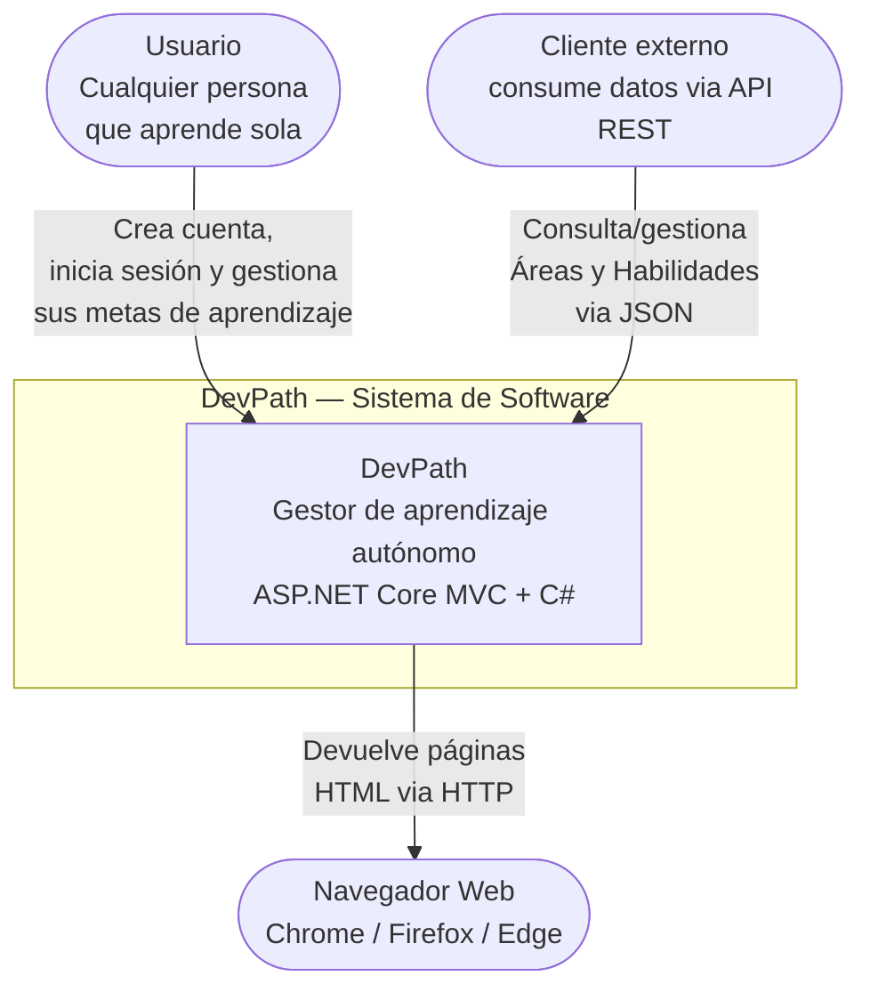
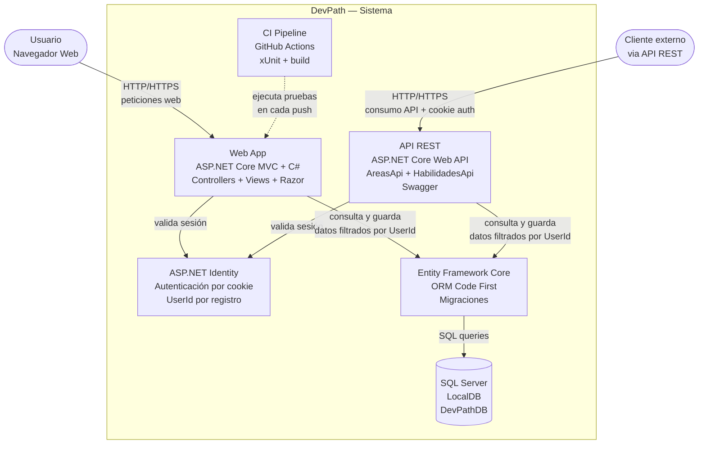
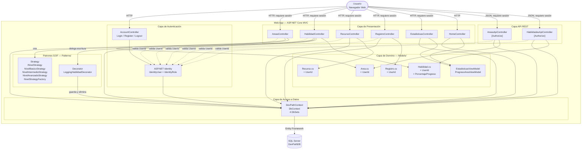

# Diagramas C4 — DevPath

## C4 Nivel 1 — Contexto del Sistema

**Para quién es:** cualquier persona, sin conocimientos técnicos.
**Qué responde:** ¿Qué hace el sistema y quién lo usa?

> Cada usuario tiene su propia cuenta (ASP.NET Identity) y solo puede ver
> y modificar sus propias Áreas, Habilidades, Recursos y Registros —
> los datos están aislados por usuario a nivel de base de datos.
> El sistema también expone una API REST para consumo externo,
> protegida con el mismo esquema de autenticación.

---

## C4 Nivel 2 — Contenedores

**Para quién es:** equipo técnico.
**Qué responde:** ¿En qué piezas técnicas está dividido el sistema y cómo se comunican?

> La Web App y la API REST comparten el mismo DevPathContext, los mismos
> modelos y el mismo esquema de autenticación de ASP.NET Identity.
> Todas las consultas —tanto en la Web App como en la API— se filtran por
> el `UserId` del usuario autenticado, garantizando que cada persona solo
> acceda a su propia información.
> El pipeline de CI (GitHub Actions) corre las pruebas xUnit en cada push
> para detectar regresiones antes de fusionar cambios.
> En desarrollo corre con IIS Express + LocalDB. Despliegue: contenedor
> Docker en un servicio gratuito/de bajo costo (AWS/Azure free tier).

---

## C4 Nivel 3 — Componentes

**Para quién es:** desarrolladores que trabajan en el proyecto.
**Qué responde:** ¿Qué hay dentro de la Web App — la pieza principal del sistema?

> Este nivel muestra los componentes internos de la Web App:
> el controlador de cuentas y ASP.NET Identity (autenticación),
> los controladores MVC y de API —todos protegidos y filtrando por
> `UserId`—, los patrones GOF implementados (Strategy para lógica de
> niveles y Decorator para logging), los modelos de dominio (todos con
> `UserId` para aislamiento por usuario) y el `DevPathContext` como
> puente hacia SQL Server.
